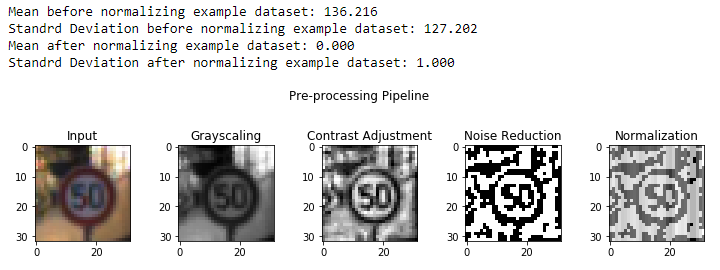
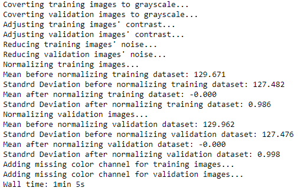
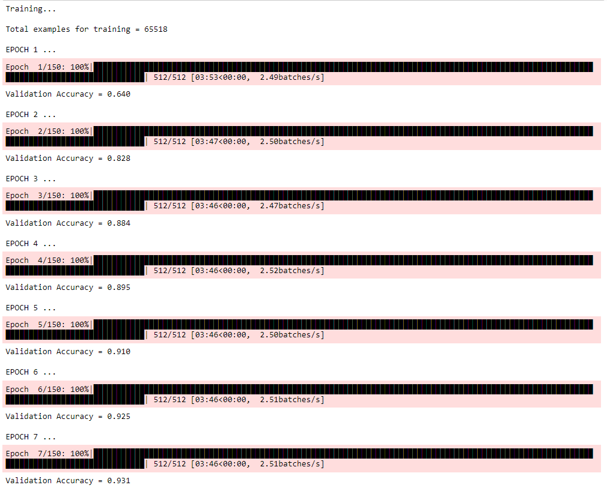
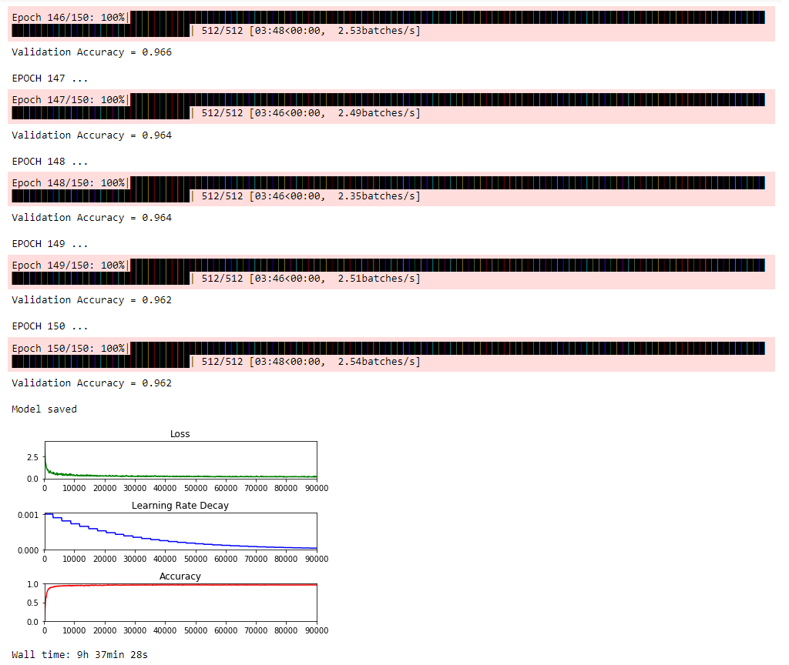
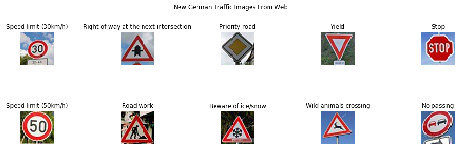
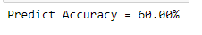
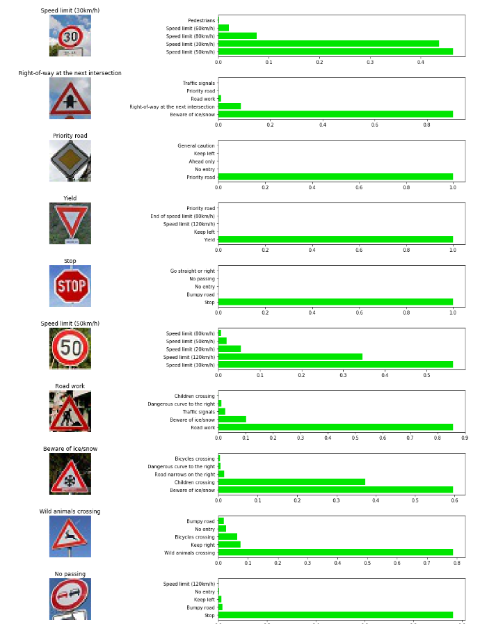

# Traffic Sign Classifier

## Overview   
   
This writeup reflects upon the **Traffic Sign Classifier** project by explaining how the image processing pipeline works, identifying any shortcomings and proposing potential improvements. 


## Project Goals

The main goals of the **Traffic Sign Classifier** project are:

1. Development of a code pipeline that uses *deep learning* for identifying German road signs  
2. A description of the above pipeline along with an analysis of the approach taken as well as the results

## Reflection

### Pipeline Overview
1. Load the traffic dataset (download from [here](https://d17h27t6h515a5.cloudfront.net/topher/2017/February/5898cd6f_traffic-signs-data/traffic-signs-data.zip))
2. Explore, summarize and visualize the dataset
3. Design (using [Tensorflow](https://www.tensorflow.org/)), train and test a CNN deep learning image classification model 
4. Use the model to make predictions on new images acquired from the web
5. Analyze the softmax probabilities (prediction certainty) of the new images

### Project Code
The image classifier has been implemented as a Jupyter notebook & can be viewed [here](https://github.com/wkhattak/Traffic-Sign-Classifier/blob/master/Traffic_Sign_Classifier.ipynb).

## Rubric Points

### Data Set Summary & Exploration

#### 1. Provide a basic summary of the data set. In the code, the analysis should be done using python, numpy and/or pandas methods rather than hardcoding results manually.

I used a combination of Pandas library and Python to calculate summary statistics of the traffic
signs data set as shown below:

```python
...
n_train = X_train_working_copy.shape[0]
n_validation = X_valid_working_copy.shape[0]
image_shape =  str(X_train_working_copy.shape[1]) + ' x ' + str(X_train_working_copy.shape[2]) + ' x ' + str(X_train_working_copy.shape[3])
n_classes = len(np.unique(y_train_working_copy))

print("Number of training images =", n_train)
print("Number of validation images =", n_validation)
print("Image data shape (Height x Width x Color Channels) =", image_shape)
print("Number of classes =", n_classes)
```


```python
...
n_test = X_test_working_copy.shape[0]
print("Number of test images =", n_test)
```


To get a better idea of the training dataset, the following visualization was generated that shows the image classes along with a sample image from each class:


#### 2. Include an exploratory visualization of the dataset.

Here is an exploratory visualization of the dataset. It is a bar chart that shows the distribution of the classes in the training dataset. It is quite clear from the class distribution that we don't have a balanced training dataset.


### Design and Test a Model Architecture

#### Q1. Describe how you preprocessed the image data. What techniques were chosen and why did you choose these techniques? 

#### Augmentation

Based on the exploratory analysis of the dataset, I decided to first augment my data by generating additional data. Failure to do so impacts the accuracy of the model because the more represented classes stand a higher chance of being predicted.

However, rather than blindly augmenting images for all the classes, I decided to only do it for the minority classes i.e. classes that were below 1.6% of the whole dataset.

The image augmentation/class balancing techniques (based on [OpenCV](https://opencv.org/)) include:

* **Rotation**: `cv2.getRotationMatrix2D()` & `cv2.warpAffine()`
* **Horizontal flip**: `cv2.getRotationMatrix2D()` & `cv2.warpAffine()`
* **Zooming in/out**: `cv2.warpPerspective()`
* **Affine transformation**: `cv2.findHomography()` & `cv2.warpPerspective()`

One important point is that not all classes could be rotated or horizontally flipped as it either totally renders the road sign useless or makes it part of the opposite class. On the other hand, this behavior was capitalised upon by generating images for the opposite classes e.g. *keep left <--> keep right*. The below image shows some examples of the application of the aforementioned techniques:


Below is the result after image augmentation/dataset balancing:


#### Pre-processing

Following image pre-processing techniques were applied (these techniques are a combination of generally known image enhancement techniques and techniques mentioned in [Pierre Sermanet and Yann LeCun](http://yann.lecun.com/exdb/publis/pdf/sermanet-ijcnn-11.pdf) paper):

1. **Grayscaling**: Images were grayscaled as grayscaling seems to increase the accuracy of the model by being indifferent to color. Also, it dramatically reduces image size as there's only 1 color channel, which helps with speeding up the training cycle. `cv2.cvtColor(img, cv2.COLOR_RGB2GRAY)` function was used for grayscaling.

2. **Histogram Normalization**: Images were made sharper by adjusting their contrast via Histogram Normalization technique. Instead of applying a single contrast value across the image, different values are applied to different tiles of the image through Contrast Limited Adaptive Histogram Equalization (CLAHE) technique. This results in much sharper contrast. `cv2.createCLAHE()` function was used to achieve CLAHE.

3. **Adaptive Threshold**: To reduce noise, Adaptive Thresholding was applied that further helps in filtering out unnecessary pixels. `cv2.adaptiveThreshold()` function was employed.

4. **Normalization**: Normalization helps the optimizer to reduce the loss as quickly as possible as it doesn't need to do too much searching. Hence, the images were normalized. However, using the prescribed `(pixel - 128)/ 128` technique didn't really achieve `0` mean & `unit` variance. Instead,  `sklearn.preprocessing` package's `scale()` method was used that resulted in achieving `0` mean & `1` variance.

As an example, consider the following image that displays the application of the above techniques:



The following image displays the application of the aforementioned techniques on *test* and *validation* datasets:



#### Q2. Describe what your final model architecture looks like including model type, layers, layer sizes, connectivity, etc? 

The architecture of the CNN is based on the famous [LeNet-5](http://yann.lecun.com/exdb/publis/pdf/lecun-01a.pdf) architecure for [MNIST](http://yann.lecun.com/exdb/mnist/) digit recognition. However, to increase the depth of the network, one more convolution layer was added. Further, to reduce overfitting and make the network more robust, [L2 Regularization](https://en.wikipedia.org/wiki/Regularization_(mathematics)) & [Dropout](https://www.cs.toronto.edu/~hinton/absps/JMLRdropout.pdf) were added. 

My final model architecture consisted of 6 layers as descried in the following table:

| Layer No.|Component| Description	        					| 
|:--:|:--------:|:----------------------------------:| 
|1| Convolution 5x5   | Input 32x32x1, 1x1 Stride, SAME padding, Output 32x32x16, Initializer Xavier|
|| RELU| Activation|
||Max Pooling 2x2| Input 32x32x16, 2x2 Stride, Output 16x16x16| 				
|2| Convolution 5x5   | Input 16x16x16, 1x1 Stride, SAME Padding, Output 16x16x32, Initializer Xavier|
|| RELU| Activation|
||Max Pooling 2x2| Input 16x16x32, 2x2 Stride, Output 8x8x32|
|3| Convolution 5x5   | Input 8x8x32, 1x1 Stride, SAME Padding, Output 8x8x64, Initializer Xavier|
|| RELU| Activation|
||Max Pooling 2x2| Input 8x8x64, 2x2 Stride, Output 4x4x64|
|4| Fully Connected| Input 1024, Output 120, Initializer Xavier|
|| Dropout| Keep Probability 0.5|
|5| Fully Connected| Input 120, Output 84, Initializer Xavier|
|| Dropout| Keep Probability 0.5|
|6| Fully Connected| Input 84, Output 43, Initializer Xavier|

#### Q3. Describe how you trained your model?

The model was trained by feeding in the pre-processed `65,518` grayscale images with a batch size of `128` and `150` epochs. Initially a fixed learning rate of `0.001` was used but later on, an exponentially decaying learning rate with a factor of `0.90` and initial rate of `0.001`was used. Also, all the weights were initialized using [Xavier](http://citeseerx.ist.psu.edu/viewdoc/download?doi=10.1.1.207.2059&rep=rep1&type=pdf) initializer that aims to keep the scale of the gradients roughly the same in all layers. For optimization, [Adam](https://en.wikipedia.org/wiki/Stochastic_gradient_descent#Adam) optimizer was used as it is known to perform better than the classical [Stochastic Gradient Descent](https://en.wikipedia.org/wiki/Stochastic_gradient_descent) optimizer.

#### Q4. Describe the approach taken for finding a solution and getting the validation set accuracy to be at least 0.93?

To solve the problem at hand, I started off with the LeNet architecture as is because it is renowned for solving a similar problem i.e. recognizing images of hand written numbers from `0-9`. Based on *convolution*, such an architecture helps to decrease the breadth of the network and enables to increase the depth without compromising the accuracy. Different *learning rates*, *batch sizes* and *number of epochs* were tried. However, just by using the LeNet as is, the validation accuracy was not reaching the required minimum of `0.93`.

Consequently, I started incorporating other suggested techniques, namely *dropout*, *L2 Regularization*,*decaying learning rate*, *Xavier initialising of weights* and *direct feed-in* from convolution layers to the fully connected layers (as described in the  Pierre Sermanet and Yann LeCun paper). Upon experimentation, the introduction of *direct feed-in* made the model behave very unreliably and the validation accuracy was stuck at a very low number despite training the model for a number of epochs. It seems that there might be some fundamental implementation issue in the code that is creating this issue. So it was decided to drop the idea of adding *direct feed-in* for now. After much trail & error, values of `0.001`,`0.90`,`128`,`150` were chosen as *initial learning rate*, *decay rate*, *training batch size*, *number of epochs* were chosen respectively as the most appropriate values for the model. These hyperparameter values resulted in achieving a *validation accuracy* of `0.962` and a *test accuracy* of `0.939`. These results indicate almost same accuracy level on both *validation* and *test* datasets and assures model's robustness when it comes to predicting unseen data.

The below code listing shows how the different accuracies/plots were generated.

```python
for batch_i in batches_pbar:
            batch_start = batch_i*BATCH_SIZE
            batch_x, batch_y = X_train_grayscale[batch_start:batch_start + BATCH_SIZE], y_train_working_copy[batch_start:batch_start + BATCH_SIZE]         
            _,t_loss,l_rate,steps = sess.run([training_operation,loss,learning_rate,global_step], feed_dict={x: batch_x, y: batch_y, keep_prob: 0.5})                      
            # Log every 100 batches
            if not batch_i % log_batch_step:
                # Calculate Training and Validation accuracy after n batches
                training_accuracy = sess.run(accuracy_operation, feed_dict={x: X_train_grayscale, y: y_train_working_copy, keep_prob: 1.0})
                validation_accuracy = sess.run(accuracy_operation, feed_dict={x: X_valid_grayscale, y: y_valid_working_copy, keep_prob: 1.0})

                # Log batches
                previous_batch = batches[-1] if batches else 0
                batches.append(log_batch_step + previous_batch)
                loss_batch.append(t_loss)
                learning_rate_decay.append(l_rate)
                train_accuracy_batch.append(training_accuracy)
                valid_accuracy_batch.append(validation_accuracy)

        # Calculate Validation accuracy for this epoch i.e. across all batches for the complete dataset
        validation_accuracy_epoch = evaluate(X_valid_grayscale, y_valid_working_copy) # for this EPOCH
        average_validation_accuracy = validation_accuracy_epoch * 100 # just for keeping hold of last accuracy for writing out to file
        
        print("Validation Accuracy = {:.3f}".format(validation_accuracy_epoch))
...
loss_plot = plt.subplot(311)
loss_plot.set_title('Loss')
loss_plot.plot(batches, loss_batch, 'g')
loss_plot.set_xlim([batches[0], batches[-1]])

l_rate_plot = plt.subplot(312)
l_rate_plot.set_title('Learning Rate Decay')
l_rate_plot.plot(batches, learning_rate_decay, 'b')
l_rate_plot.set_xlim([batches[0], batches[-1]])

accuracy_plot = plt.subplot(313)
accuracy_plot.set_title('Accuracy')
accuracy_plot.plot(batches, train_accuracy_batch, 'x', label='Training Accuracy')
accuracy_plot.plot(batches, valid_accuracy_batch, 'r', label='Validation Accuracy')
accuracy_plot.set_ylim([0, 1.0])
accuracy_plot.set_xlim([batches[0], batches[-1]])
accuracy_plot.legend(loc=4)

plt.tight_layout()
plt.show()
```





### Test a Model on New Images

#### Q1. Choose five German traffic signs found on the web and provide them in the report. For each image, discuss what quality or qualities might be difficult to classify.

Here are ten German traffic signs that I found on the web:



All images are of good quality. However, *Wild animals crossing* and *No passing* might be difficult to classify because of their angle. Also, the first, fourth and the last images have part of another road sign visible as well.

#### Q2. Discuss the model's predictions on these new traffic signs and compare the results to predicting on the test set?

Here are the results of the prediction:

| Actual                 |Predicted                 |
|:----------------------:|:------------------------:|
|[Model predictions](writeup-images/predict-Actual-150-128-2500.png)|[Model predictions](writeup-images/predict-Predict-150-128-2500.png)| 							



The model was able to correctly guess 6 of the 10 traffic signs, which gives an accuracy of `60%`. Surprisingly enough, both the speed limit signs were predicted incorrectly & swapped (straightforward shapes), while on the other hand, *Wild animals crossing* sign was predicted correctly (complex shape).

This result is not at par with the test results. This could be attributed to the quality of training, validation and test images. These images seem to be of lower quality, hence there's a difference between new images and what the model was trained on. Other reason could be that although the model has a *validation* accuracy of `0.962`, there's room for improvement as some individuals have even reported `99%` accuracy. In future, *inception modules*, *direct feed-in*, *further decrease in learning rate* and even *colored images* can be used (as the background color/edge color might help to further increase the certainty of the model).

#### Q3. Describe how certain the model is when predicting on each of the five new images by looking at the softmax probabilities for each prediction? 

The code for making predictions on my final model is located in the third-last cell of the Jupyter notebook labelled *Predict the Sign Type for Each Image*. While the second-last cell labelled *Analyze Performance* and the last cell labelled *Output Top 5 Softmax Probabilities For Each Image Found on the Web* calculate the *accuracy* of the model and *softmax probabilities* on these new images respectively.

