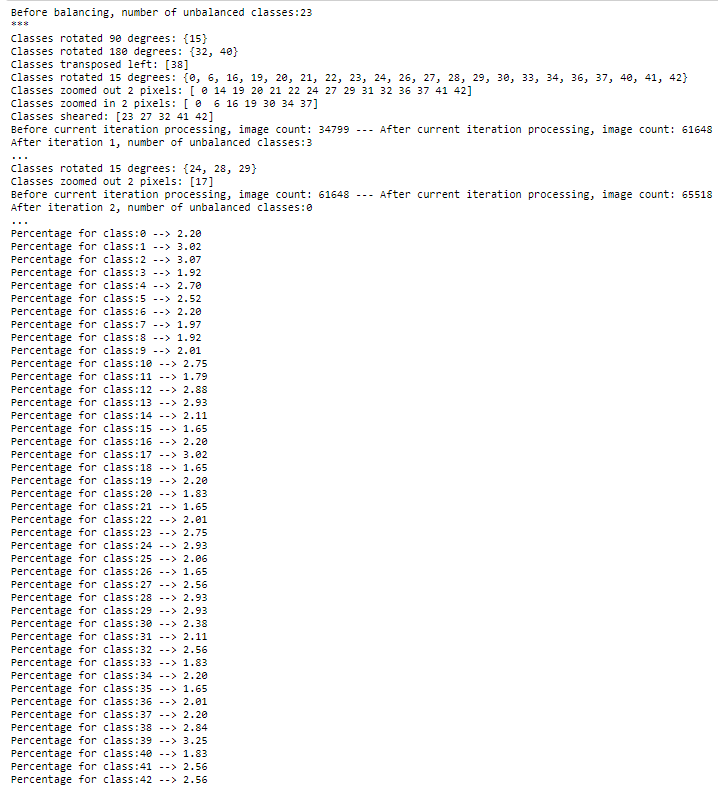

# Traffic Sign Classifier

## Overview   
   
This writeup reflects upon the **Finding Lane Line** project by explaining how the image processing pipeline works, identifying any shortcomings and proposing potential improvements. 


## Project Goals

The main goals of the **Traffic Sign Classifier** project are:

1. Development of a code pipeline that uses *deep learning* for identifying German road signs  
2. A description of the above pipeline along with an analysis of the approach taken as well as the results

## Reflection

### Pipeline Overview
1. Load the traffic dataset (download from [here](https://d17h27t6h515a5.cloudfront.net/topher/2017/February/5898cd6f_traffic-signs-data/traffic-signs-data.zip))
2. Explore, summarize and visualize the dataset
3. Design (using [Tensorflow](https://www.tensorflow.org/)), train and test a CNN deep learning image classification model 
4. Use the model to make predictions on new images acquired from the web
5. Analyze the softmax probabilities (prediction certainty) of the new images

### Project Code
The image classifier has been implemented as a Jupyter notebook & can be viewed [here](https://github.com/wkhattak/Traffic-Sign-Classifier/blob/master/Traffic_Sign_Classifier.ipynb).

## Rubric Points

### Data Set Summary & Exploration

#### 1. Provide a basic summary of the data set. In the code, the analysis should be done using python, numpy and/or pandas methods rather than hardcoding results manually.

I used a combination of Pandas library and Python to calculate summary statistics of the traffic
signs data set as shown below:

```python
...
n_train = X_train_working_copy.shape[0]
n_validation = X_valid_working_copy.shape[0]
image_shape =  str(X_train_working_copy.shape[1]) + ' x ' + str(X_train_working_copy.shape[2]) + ' x ' + str(X_train_working_copy.shape[3])
n_classes = len(np.unique(y_train_working_copy))

print("Number of training images =", n_train)
print("Number of validation images =", n_validation)
print("Image data shape (Height x Width x Color Channels) =", image_shape)
print("Number of classes =", n_classes)
```


```python
...
n_test = X_test_working_copy.shape[0]
print("Number of test images =", n_test)
```


To get a better idea of the training dataset, the following visualization was generated that shows the image classes along with a sample image from each class:


#### 2. Include an exploratory visualization of the dataset.

Here is an exploratory visualization of the dataset. It is a bar chart that shows the distribution of the classes in the training dataset. It is quite clear from the class distribution that we don't have a balanced training dataset.


### Design and Test a Model Architecture

#### Q1. Describe how you preprocessed the image data. What techniques were chosen and why did you choose these techniques? 

Based on the exploratory analysis of the dataset, I decided to first augment my data by generating additional data. Failure to do so impacts the accuracy of the model because the more represented classes stand a higher chance of being predicted.

However, rather than blindly augmenting images for all the classes, I decided to only do it for the minority classes i.e. classes that were below 1.6% of the whole dataset.

The image augmentation/class balancing techniques include:

* Rotation
* Horizontal flip
* Zooming in/out
* Affine transformation

One important point is that not all classes could be rotated or horizontally flipped as it either totally renders the road sign useless or makes it part of the opposite class. On the other hand, this behavior was capitalised upon by generating images for the opposite classes e.g. *keep left <--> keep right*. The below image shows some examples of the application of the aforementioned techniques:


Below is the result after image augmentation/dataset balancing:




As a first step, I decided to convert the images to grayscale because ...

Here is an example of a traffic sign image before and after grayscaling.

![alt text][image2]

As a last step, I normalized the image data because ...

I decided to generate additional data because ... 

To add more data to the the data set, I used the following techniques because ... 

Here is an example of an original image and an augmented image:

![alt text][image3]

The difference between the original data set and the augmented data set is the following ... 


#### Q2. Describe what your final model architecture looks like including model type, layers, layer sizes, connectivity, etc.) Consider including a diagram and/or table describing the final model.

My final model consisted of the following layers:

| Layer         		|     Description	        					| 
|:---------------------:|:---------------------------------------------:| 
| Input         		| 32x32x3 RGB image   							| 
| Convolution 3x3     	| 1x1 stride, same padding, outputs 32x32x64 	|
| RELU					|												|
| Max pooling	      	| 2x2 stride,  outputs 16x16x64 				|
| Convolution 3x3	    | etc.      									|
| Fully connected		| etc.        									|
| Softmax				| etc.        									|
|						|												|
|						|												|
 


####3. Describe how you trained your model. The discussion can include the type of optimizer, the batch size, number of epochs and any hyperparameters such as learning rate.

To train the model, I used an ....

####4. Describe the approach taken for finding a solution and getting the validation set accuracy to be at least 0.93. Include in the discussion the results on the training, validation and test sets and where in the code these were calculated. Your approach may have been an iterative process, in which case, outline the steps you took to get to the final solution and why you chose those steps. Perhaps your solution involved an already well known implementation or architecture. In this case, discuss why you think the architecture is suitable for the current problem.

My final model results were:
* training set accuracy of ?
* validation set accuracy of ? 
* test set accuracy of ?

If an iterative approach was chosen:
* What was the first architecture that was tried and why was it chosen?
* What were some problems with the initial architecture?
* How was the architecture adjusted and why was it adjusted? Typical adjustments could include choosing a different model architecture, adding or taking away layers (pooling, dropout, convolution, etc), using an activation function or changing the activation function. One common justification for adjusting an architecture would be due to overfitting or underfitting. A high accuracy on the training set but low accuracy on the validation set indicates over fitting; a low accuracy on both sets indicates under fitting.
* Which parameters were tuned? How were they adjusted and why?
* What are some of the important design choices and why were they chosen? For example, why might a convolution layer work well with this problem? How might a dropout layer help with creating a successful model?

If a well known architecture was chosen:
* What architecture was chosen?
* Why did you believe it would be relevant to the traffic sign application?
* How does the final model's accuracy on the training, validation and test set provide evidence that the model is working well?
 

###Test a Model on New Images

####1. Choose five German traffic signs found on the web and provide them in the report. For each image, discuss what quality or qualities might be difficult to classify.

Here are five German traffic signs that I found on the web:

![alt text][image4] ![alt text][image5] ![alt text][image6] 
![alt text][image7] ![alt text][image8]

The first image might be difficult to classify because ...

####2. Discuss the model's predictions on these new traffic signs and compare the results to predicting on the test set. At a minimum, discuss what the predictions were, the accuracy on these new predictions, and compare the accuracy to the accuracy on the test set (OPTIONAL: Discuss the results in more detail as described in the "Stand Out Suggestions" part of the rubric).

Here are the results of the prediction:

| Image			        |     Prediction	        					| 
|:---------------------:|:---------------------------------------------:| 
| Stop Sign      		| Stop sign   									| 
| U-turn     			| U-turn 										|
| Yield					| Yield											|
| 100 km/h	      		| Bumpy Road					 				|
| Slippery Road			| Slippery Road      							|


The model was able to correctly guess 4 of the 5 traffic signs, which gives an accuracy of 80%. This compares favorably to the accuracy on the test set of ...

####3. Describe how certain the model is when predicting on each of the five new images by looking at the softmax probabilities for each prediction. Provide the top 5 softmax probabilities for each image along with the sign type of each probability. (OPTIONAL: as described in the "Stand Out Suggestions" part of the rubric, visualizations can also be provided such as bar charts)

The code for making predictions on my final model is located in the 11th cell of the Ipython notebook.

For the first image, the model is relatively sure that this is a stop sign (probability of 0.6), and the image does contain a stop sign. The top five soft max probabilities were

| Probability         	|     Prediction	        					| 
|:---------------------:|:---------------------------------------------:| 
| .60         			| Stop sign   									| 
| .20     				| U-turn 										|
| .05					| Yield											|
| .04	      			| Bumpy Road					 				|
| .01				    | Slippery Road      							|


For the second image ... 

### (Optional) Visualizing the Neural Network (See Step 4 of the Ipython notebook for more details)
####1. Discuss the visual output of your trained network's feature maps. What characteristics did the neural network use to make classifications?